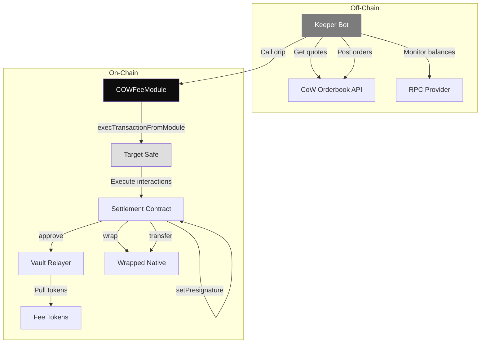

## System Architecture

The CoW Fee Module is built on a modular architecture that separates concerns between on-chain security and off-chain orchestration.

### High-Level Architecture



## Smart Contract Architecture

### Module Pattern

The `COWFeeModule` implements the Safe module pattern, allowing it to execute transactions on behalf of a Safe without requiring multi-signature approval for each operation.

```solidity COWFeeModule.sol
function _execFromModule(address _to, bytes memory _cd) internal returns (bytes memory) {
    (bool success, bytes memory returnData) =
        targetSafe.execTransactionFromModuleReturnData(_to, 0, _cd, ISafe.Operation.Call);
    if (!success) {
        assembly ("memory-safe") {
            revert(add(returnData, 0x20), mload(returnData))
        }
    }
    return returnData;
}
```

<Info>
This pattern enables automated operations while maintaining security through the Safe's module authorization system.
</Info>

### Interaction-Based Execution

The module leverages CoW Protocol Settlement's interaction mechanism to batch multiple operations:

```solidity COWFeeModule.sol
function _execInteractions(IGPv2Settlement.InteractionData[] memory _interactions) internal {
    address[] memory tokens = new address[](0);
    uint256[] memory clearingPrices = new uint256[](0);
    IGPv2Settlement.TradeData[] memory trades = new IGPv2Settlement.TradeData[](0);
    IGPv2Settlement.InteractionData[][3] memory interactions =
        [new IGPv2Settlement.InteractionData[](0), _interactions, new IGPv2Settlement.InteractionData[](0)];
    bytes memory cd = abi.encodeCall(IGPv2Settlement.settle, (tokens, clearingPrices, trades, interactions));
    _execFromModule(address(settlement), cd);
}
```

<Note>
**Interaction Phases**: CoW Protocol Settlement supports three interaction phases (pre, intra, post). The module uses the middle phase for all operations.
</Note>

### Data Structures

The module defines two key data structures:

```solidity COWFeeModule.sol
struct Revocation {
    address token;
    address spender;
}

struct SwapToken {
    address token;
    uint256 sellAmount;
    uint256 buyAmount;
}
```

<CardGroup cols={2}>
  <Card title="Revocation" icon="ban">
    Used by `revoke()` to specify which token approvals to remove for which spenders.
  </Card>
  <Card title="SwapToken" icon="arrow-right-arrow-left">
    Used by `drip()` to specify tokens to swap with their sell and buy amounts.
  </Card>
</CardGroup>

### Access Control

The module implements simple but effective access control:

```solidity COWFeeModule.sol
error OnlyKeeper();

modifier onlyKeeper() {
    if (msg.sender != keeper) {
        revert OnlyKeeper();
    }
    _;
}

function drip(address[] calldata _approveTokens, SwapToken[] calldata _swapTokens) 
    external 
    onlyKeeper 
{
    // ...
}
```

<Warning>
**Single Keeper Model**: The current architecture supports a single keeper address. For redundancy, consider deploying multiple modules or implementing key rotation.
</Warning>

### Validation Logic

The module validates that swap amounts meet minimum thresholds:

```solidity COWFeeModule.sol
error BuyAmountTooSmall();

for (uint256 i = 0; i < _swapTokens.length;) {
    SwapToken calldata swapToken = _swapTokens[i];
    order.sellToken = IERC20(swapToken.token);
    order.sellAmount = swapToken.sellAmount;
    order.buyAmount = swapToken.buyAmount;
    if (swapToken.buyAmount < minOut) revert BuyAmountTooSmall();
    // ...
}
```

<Info>
This on-chain validation provides defense-in-depth against misconfigured keeper instances.
</Info>

## TypeScript Keeper Architecture

### Modular Design

The keeper bot is organized into focused modules:

```
ts/
├── abi.ts                    # Contract ABIs
├── config.ts                 # Configuration types
├── drip/
│   ├── drip.ts              # Core drip function
│   ├── dripItAll.ts         # Main orchestration
│   ├── getAllowances.ts     # Allowance queries
│   ├── getAppData.ts        # App data generation
│   ├── getBalances.ts       # Balance queries
│   ├── getEthToWrap.ts      # Native token handling
│   ├── getTokenBalances.ts  # Token discovery
│   ├── getTokensToSwap.ts   # Token filtering
│   ├── postOrders.ts        # Order posting
│   └── swapTokens.ts        # Swap execution
└── utils/
    ├── executeTransaction.ts # Transaction execution
    ├── gasPriceFetchers.ts   # Gas price utilities
    ├── misc.ts               # Helper functions
    ├── readConfig.ts         # Config parsing
    └── readline.ts           # User input
```

### Configuration Management

The keeper uses a hierarchical configuration system:

```typescript ts/config.ts
export const SUPPORTED_NETWORKS = [
  "mainnet",
  "gnosis",
  "arbitrum",
  "base",
  "sepolia",
  "avalanche",
  "polygon",
  "bnb",
  "linea",
  "plasma",
  "ink",
] as const;

export const networkSpecificConfigs: Record<
  (typeof SUPPORTED_NETWORKS)[number],
  NetworkDetails
> = {
  mainnet: {
    rpcUrl: "https://eth.llamarpc.com",
    explorer: "https://explorer.cow.fi",
    chainId: SupportedChainId.MAINNET,
  },
  gnosis: {
    rpcUrl: "https://1rpc.io/gnosis",
    explorer: "https://explorer.cow.fi/gc",
    chainId: SupportedChainId.GNOSIS_CHAIN,
  },
  // ... other networks
};
```

### Token Discovery Strategy Pattern

The keeper implements a strategy pattern for token discovery:

<Tabs>
  <Tab title="Explorer Strategy">
    Uses external APIs to query token holdings:
    
    ```typescript
    if (tokenListStrategy === "explorer") {
      // Use Ethplorer, Blockscout, or other explorer APIs
      const response = await fetch(
        `${explorerApi}/getAddressInfo/${settlement}?apiKey=${apiKey}`
      );
      const data = await response.json();
      return data.tokens;
    }
    ```
    
    <Note>
    **Pros**: Fast, no RPC calls required  
    **Cons**: Depends on external API availability
    </Note>
  </Tab>
  
  <Tab title="Chain Strategy">
    Scans blockchain events to discover tokens:
    
    ```typescript
    if (tokenListStrategy === "chain") {
      const settlementContract = new ethers.Contract(
        settlement,
        settlementAbi,
        provider
      );
      
      const currentBlock = await provider.getBlockNumber();
      const fromBlock = currentBlock - lookbackRange;
      
      const tradeEvents = await settlementContract.queryFilter(
        settlementContract.filters.Trade(),
        fromBlock,
        currentBlock
      );
      
      // Extract unique tokens from trade events
      const tokens = new Set();
      for (const event of tradeEvents) {
        tokens.add(event.args.sellToken);
        tokens.add(event.args.buyToken);
      }
      
      return Array.from(tokens);
    }
    ```
    
    <Note>
    **Pros**: No external dependencies, always current  
    **Cons**: Requires more RPC calls, slower
    </Note>
  </Tab>
</Tabs>

### Async Parallel Processing

The keeper maximizes efficiency through parallel operations:

```typescript ts/drip/getTokensToSwap.ts
// Fetch balances and allowances in parallel
const [balances, allowances] = await Promise.all([
  getBalances(provider, config.gpv2Settlement, tokenAddresses),
  getAllowances(
    provider,
    config.gpv2Settlement,
    config.vaultRelayer,
    tokenAddresses
  ),
]);

// Get quotes for all tokens in parallel
const quotes = await Promise.allSettled(
  unfilteredWithBalanceAndAllowance.map((token) =>
    orderBookApi.getQuote({
      sellToken: token.address,
      sellAmountBeforeFee: token.balance.toString(),
      kind: OrderQuoteSideKindSell.SELL,
      buyToken: config.wrappedNativeToken,
      from: config.gpv2Settlement,
    })
  )
);
```

<Info>
Using `Promise.all()` and `Promise.allSettled()` significantly reduces total execution time by parallelizing independent operations.
</Info>

### Order Posting with Error Handling

The keeper gracefully handles partial failures when posting orders:

```typescript ts/drip/postOrders.ts
export async function postOrders(
  orderBookApi: OrderBookApi,
  appDataHex: string,
  nextValidTo: number,
  appDataContent: string,
  config: IConfig,
  toSwap: Awaited<GetTokensToSwapResult[]>
) {
  // Post all orders in parallel
  const orders = await Promise.allSettled(
    toSwap.map((token) =>
      orderBookApi.sendOrder({
        sellToken: token.address,
        buyToken: config.wrappedNativeToken,
        sellAmount: token.balance.toString(),
        buyAmount: token.buyAmount.toString(),
        validTo: nextValidTo,
        appData: appDataContent,
        appDataHash: appDataHex,
        feeAmount: "0",
        kind: OrderKind.SELL,
        partiallyFillable: true,
        sellTokenBalance: SellTokenSource.ERC20,
        buyTokenBalance: BuyTokenDestination.ERC20,
        signingScheme: SigningScheme.PRESIGN,
        signature: "0x",
        from: config.gpv2Settlement,
        receiver: config.receiver,
      })
    )
  );

  // Separate successful and failed orders
  const failedOrders = orders.filter((x) => x.status === "rejected");
  const successfullyPostedOrders = orders
    .filter((x) => x.status === "fulfilled")
    .map((x) => (x as PromiseFulfilledResult<string>).value);

  // Only proceed with successfully posted orders
  const toActuallySwap = toSwap.filter(
    (x, idx) => orders[idx].status === "fulfilled"
  );

  return { failedOrders, successfullyPostedOrders, toActuallySwap };
}
```

<Note>
The keeper continues execution even if some orders fail to post, ensuring maximum throughput.
</Note>

### Transaction Execution

The keeper implements robust transaction execution with gas estimation:

```typescript ts/drip/drip.ts
async function getDripTx(params: DripParams): Promise<TransactionRequest> {
  const { moduleContract, signer: signerWithProvider, toApprove, toDrip } = params;

  // Explicitly get nonce to avoid issues on some chains
  const nonce = await signerWithProvider.getTransactionCount();

  // Estimate gas prices
  let feeData = await signerWithProvider.getFeeData();
  if (!feeData.maxFeePerGas) {
    throw new Error("Failed to get max fee per gas from network");
  }

  // Build transaction
  const txBaseRequest: TransactionRequest = {
    from: await signerWithProvider.getAddress(),
    to: moduleContract.address,
    maxFeePerGas: params.maxFeePerGas || feeData.maxFeePerGas,
    maxPriorityFeePerGas: params.maxPriorityFeePerGas || feeData.maxPriorityFeePerGas,
    data: moduleContract.interface.encodeFunctionData("drip", [
      toApprove,
      toDrip,
    ]),
    value: BigNumber.from(0),
    nonce,
  };

  // Estimate gas with error handling
  const gasLimit = await signerWithProvider
    .estimateGas(txBaseRequest)
    .catch((error) => {
      console.error("Error estimating gas. Please review the transaction parameters");
      throw new Error("Error estimating gas", { cause: error });
    });

  return { ...txBaseRequest, gasLimit };
}
```

<Warning>
**Nonce Management**: The keeper explicitly fetches nonces to avoid issues on chains like Gnosis where automatic nonce selection can fail.
</Warning>

## Integration Points

### CoW Protocol Settlement

The module integrates deeply with CoW Protocol's Settlement contract:

```solidity src/interfaces/IGPv2Settlement.sol
interface IGPv2Settlement {
    function domainSeparator() external view returns (bytes32);
    function vaultRelayer() external view returns (address);
    
    function setPreSignature(
        bytes calldata orderUid,
        bool signed
    ) external;
    
    function settle(
        address[] memory tokens,
        uint256[] memory clearingPrices,
        TradeData[] memory trades,
        InteractionData[][3] memory interactions
    ) external;
}
```

### Safe Module Interface

The module uses Safe's module execution interface:

```solidity src/interfaces/ISafe.sol
interface ISafe {
    enum Operation {
        Call,
        DelegateCall
    }

    function execTransactionFromModuleReturnData(
        address to,
        uint256 value,
        bytes memory data,
        Operation operation
    ) external returns (bool success, bytes memory returnData);
    
    function enableModule(address module) external;
}
```

### Wrapped Native Token Interface

For native token handling:

```solidity src/interfaces/IWrappedNativeToken.sol
interface IWrappedNativeToken is IERC20 {
    function deposit() external payable;
    function withdraw(uint256) external;
}
```

## Order Presignature Scheme

The module uses CoW Protocol's presignature mechanism:

```solidity COWFeeModule.sol
function _computePreSignature(GPv2Order.Data memory order) 
    internal 
    view 
    returns (bytes memory) 
{
    bytes32 orderDigest = GPv2Order.hash(order, domainSeparator);
    return abi.encodePacked(orderDigest, address(settlement), order.validTo);
}
```

<Info>
**Presignature Format**: The presignature is a packed encoding of the order digest, settlement address, and validTo timestamp, creating a unique identifier for each order.
</Info>

### EIP-712 Order Hashing

The module uses GPv2Order library for EIP-712 compliant order hashing:

```solidity src/libraries/GPv2Order.sol
library GPv2Order {
    bytes32 internal constant KIND_SELL = keccak256("sell");
    bytes32 internal constant BALANCE_ERC20 = keccak256("erc20");
    
    struct Data {
        IERC20 sellToken;
        IERC20 buyToken;
        address receiver;
        uint256 sellAmount;
        uint256 buyAmount;
        uint32 validTo;
        bytes32 appData;
        uint256 feeAmount;
        bytes32 kind;
        bool partiallyFillable;
        bytes32 sellTokenBalance;
        bytes32 buyTokenBalance;
    }
    
    function hash(Data memory order, bytes32 domainSeparator) 
        internal 
        pure 
        returns (bytes32) 
    {
        // EIP-712 structured data hashing
        // ...
    }
}
```

## Gas Optimization Patterns

### Unchecked Arithmetic

The module uses unchecked blocks for safe iterator increments:

```solidity COWFeeModule.sol
for (uint256 i = 0; i < _tokens.length;) {
    // ... loop body ...
    unchecked {
        ++i;
    }
}
```

<Note>
This optimization saves gas by avoiding overflow checks on loop counters that cannot realistically overflow.
</Note>

### Immutable Variables

All configuration is stored as immutable:

```solidity COWFeeModule.sol
ISafe public immutable targetSafe;
address public immutable wrappedNativeToken;
address public immutable keeper;
// ... etc
```

<Info>
Immutable variables are embedded in contract bytecode, eliminating SLOAD costs and providing significant gas savings.
</Info>

### Batch Operations

The module batches multiple operations into single transactions:

```solidity COWFeeModule.sol
// Combine approvals, presignatures, wrapping, and transfers
IGPv2Settlement.InteractionData[] memory approveAndDripInteractions = 
    new IGPv2Settlement.InteractionData[](len);

// Approvals
_approveInteractions(_approveTokens, approveAndDripInteractions);

// Presignatures for each token
for (uint256 i = 0; i < _swapTokens.length;) {
    // ...
}

// Wrap native token
if (hasToWrapNativeToken) { /* ... */ }

// Transfer wrapped tokens
if (hasToTransferWrappedNativeToken) { /* ... */ }

// Execute all at once
_execInteractions(approveAndDripInteractions);
```

## Deployment Architecture

The module uses Foundry's scripting system for deployments:

```solidity script/DeployCOWFeeModule.s.sol
contract DeployCOWFeeModule is Script {
    function run() external {
        address receiver = vm.envAddress("RECEIVER");
        address wrappedNativeToken = vm.envAddress("WRAPPED_NATIVE_TOKEN");
        address keeper = vm.envAddress("KEEPER");
        address settlement = vm.envAddress("SETTLEMENT");
        bytes32 appData = vm.envBytes32("APP_DATA");
        address targetSafe = vm.envAddress("TARGET_SAFE");
        uint256 minOut = vm.envUint("MIN_OUT");

        vm.broadcast();
        COWFeeModule module =
            new COWFeeModule(
                settlement, 
                targetSafe, 
                wrappedNativeToken, 
                keeper, 
                appData, 
                receiver, 
                minOut
            );
    }
}
```

<CardGroup cols={2}>
  <Card title="Deterministic Deployments" icon="fingerprint">
    Same bytecode and constructor args produce same address across chains
  </Card>
  <Card title="Environment-Based Config" icon="gear">
    All parameters come from environment variables for security
  </Card>
</CardGroup>

## Error Handling

### Smart Contract Errors

The module uses custom errors for gas efficiency:

```solidity COWFeeModule.sol
error OnlyKeeper();
error BuyAmountTooSmall();

modifier onlyKeeper() {
    if (msg.sender != keeper) {
        revert OnlyKeeper();
    }
    _;
}
```

### Keeper Error Handling

The keeper implements graceful error handling:

```typescript ts/drip/dripItAll.ts
if (tokensToSwap.length > 0) {
  for (let i = 0; i < tokensToSwap.length; i += config.maxOrders) {
    const toSwap = tokensToSwap.slice(i, i + config.maxOrders);
    try {
      await swapTokens(moduleContract, config, signer, toSwap);
    } catch (err) {
      console.error("Error dripping:", err);
    }
    break; // Only process first batch in this iteration
  }
}
```

## Testing Strategy

The project uses Foundry for smart contract testing:

```bash
forge test -vvv --rpc-url wss://mainnet.gateway.tenderly.co
```

<Note>
Tests run against forked mainnet to ensure realistic integration testing with CoW Protocol and Safe contracts.
</Note>

## Monitoring and Observability

The keeper provides detailed logging:

```typescript
console.log("Config options:\n", config.options);
console.log("Wallet address:", wallet.address);
console.log("ETH to wrap:", formatUnits(ethToWrap, WETH_DECIMALS));
console.log("Tokens to swap:", tokensToSwap.map(/* ... */));
console.log("Total tokens pre-filter:", unfilteredWithBalanceAndAllowance.length);
console.log("Total tokens after filtering by quotes api:", quotesFiltered.length);
console.log("Total tokens after filtering by minOut:", minOutFiltered.length);
console.log(
  `Fee collection for chain ${config.network} initiated (${tokensToSwap.length} orders). ` +
  `Expecting proceeds of ${expectedUnitsFormatted} ${symbol}!\n\n` +
  `Follow the progress at ${explorerUrl}/address/${config.gpv2Settlement}`
);
```

## Performance Characteristics

<CardGroup cols={2}>
  <Card title="Gas Costs" icon="gas-pump">
    Typical drip transaction: 200k-500k gas depending on number of tokens
  </Card>
  <Card title="Execution Time" icon="clock">
    Full keeper cycle: 30-60 seconds including quote fetching and order posting
  </Card>
  <Card title="Batch Size" icon="layer-group">
    Default max 250 orders per drip transaction
  </Card>
  <Card title="RPC Calls" icon="network-wired">
    Explorer strategy: ~10 calls; Chain strategy: 100+ calls for lookback
  </Card>
</CardGroup>

## Security Architecture

<Steps>
  <Step title="Keeper Authorization">
    Only the designated keeper can call module functions, enforced by `onlyKeeper` modifier.
  </Step>
  
  <Step title="Module Permissions">
    Module must be explicitly enabled by Safe owners before it can execute transactions.
  </Step>
  
  <Step title="Immutable Configuration">
    All critical parameters are immutable, preventing configuration changes post-deployment.
  </Step>
  
  <Step title="Minimum Output Validation">
    On-chain validation ensures all swaps meet minimum output thresholds.
  </Step>
  
  <Step title="Safe Execution">
    All operations execute through Safe's audited module execution framework.
  </Step>
</Steps>

## Future Architecture Considerations

<CardGroup cols={2}>
  <Card title="Multi-Keeper Support" icon="users">
    Support multiple keeper addresses for redundancy and load balancing
  </Card>
  <Card title="Dynamic Configuration" icon="sliders">
    Allow parameter updates without redeploying (requires careful security design)
  </Card>
  <Card title="Cross-Chain Coordination" icon="globe">
    Coordinate fee collection across multiple chains from single keeper instance
  </Card>
  <Card title="Advanced Token Filtering" icon="filter">
    ML-based liquidity prediction and optimal swap timing
  </Card>
</CardGroup>

## Next Steps

<CardGroup cols={2}>
  <Card title="Deploy Your Module" icon="rocket" href="/deployment/deploy-module">
    Follow the deployment guide to launch your own instance
  </Card>
  <Card title="Contract Reference" icon="book" href="/contracts/cowfeemodule">
    Explore the complete smart contract API
  </Card>
  <Card title="Keeper Configuration" icon="gear" href="/keeper/configuration">
    Configure the keeper bot for your deployment
  </Card>
  <Card title="Operations Guide" icon="wrench" href="/operations/module-operations">
    Learn how to operate and maintain the module
  </Card>
</CardGroup>
