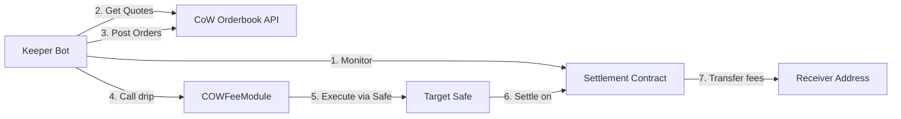

<div className="hero" style={{ padding: '3rem 0', textAlign: 'center' }}>
  <div style={{ maxWidth: '800px', margin: '0 auto' }}>
    <h1 style={{ fontSize: '3rem', fontWeight: 'bold', marginBottom: '1.5rem', color: '#0d0d0d' }}>
      CoW Fee Module
    </h1>
    <p style={{ fontSize: '1.25rem', color: '#7c7c7c', marginBottom: '2rem' }}>
      A Safe module that automates fee token collection and swapping from CoW Protocol Settlement contracts across multiple chains
    </p>
  </div>
</div>

## What is CoW Fee Module?

The CoW Fee Module is an infrastructure project that enables automated collection and conversion of trading fees accumulated in CoW Protocol Settlement contracts. As a Safe module, it provides a secure and efficient way to manage fee tokens across multiple blockchain networks.

<CardGroup cols={2}>
  <Card title="Smart Contract Module" icon="file-contract" color="#7c7c7c">
    Solidity-based Safe module that integrates directly with CoW Protocol Settlement contracts
  </Card>
  <Card title="TypeScript Keeper Bot" icon="robot" color="#7c7c7c">
    Automated bot that monitors balances, posts orders, and executes swaps
  </Card>
  <Card title="Multi-Chain Support" icon="network-wired" color="#7c7c7c">
    Deploy across Ethereum, Gnosis, Arbitrum, Base, Polygon, Avalanche, and more
  </Card>
  <Card title="CoW Protocol Integration" icon="handshake" color="#7c7c7c">
    Leverages CoW Protocol's orderbook for optimal token swapping
  </Card>
</CardGroup>

## Key Features

<Steps>
  <Step title="Automated Token Collection">
    The module monitors the Settlement contract for accumulated fee tokens and automatically identifies tokens worth swapping based on configurable minimum output values.
  </Step>
  
  <Step title="Intelligent Swap Execution">
    Uses CoW Protocol's orderbook API to get quotes, filter out illiquid tokens, and execute swaps to wrapped native tokens (WETH, WXDAI, etc.).
  </Step>
  
  <Step title="Native Token Handling">
    Automatically wraps native ETH/xDAI to their wrapped equivalents and transfers them to the designated receiver address.
  </Step>
  
  <Step title="Secure Module Operations">
    All operations execute through Safe's module framework, ensuring security and auditability of fee collection transactions.
  </Step>
</Steps>

## How It Works

The CoW Fee Module operates through a two-component architecture:

<Note>
**Smart Contract Layer**: The `COWFeeModule` contract (src/COWFeeModule.sol:10) is a Safe module that can execute transactions on behalf of a target Safe. It provides three main functions:
- `drip()` - Commits presignatures for sell orders and optionally approves tokens
- `approve()` - Approves tokens to be spent by the vault relayer
- `revoke()` - Revokes token approvals
</Note>

<Note>
**Keeper Bot Layer**: The TypeScript keeper bot (index.ts:5) performs the off-chain work:
1. Discovers tokens held by the Settlement contract
2. Gets quotes from CoW Protocol orderbook
3. Filters tokens by liquidity and minimum output value
4. Posts orders to the orderbook API
5. Calls the module's `drip()` function to commit presignatures
</Note>

## Architecture Overview



## Supported Networks

The CoW Fee Module is deployed across multiple EVM-compatible chains:

<CardGroup cols={3}>
  <Card title="Ethereum" icon="ethereum">
    Chain ID: 1
  </Card>
  <Card title="Gnosis Chain" icon="link">
    Chain ID: 100
  </Card>
  <Card title="Arbitrum One" icon="circle">
    Chain ID: 42161
  </Card>
  <Card title="Base" icon="b">
    Chain ID: 8453
  </Card>
  <Card title="Polygon" icon="triangle">
    Chain ID: 137
  </Card>
  <Card title="Avalanche" icon="mountain">
    Chain ID: 43114
  </Card>
</CardGroup>

<Info>
View the complete list of deployment addresses in the [networks.json](https://github.com/cowprotocol/cow-fee/blob/main/networks.json) file.
</Info>

## Quick Example

Here's how the keeper bot initiates fee collection:

```typescript index.ts
import { ethers } from "ethers";
import { dripItAll } from "./ts/drip/dripItAll";
import { readConfig } from "./ts/utils/readConfig";

const main = async () => {
  const [config, provider] = await readConfig();
  console.log("Config options:\n", config.options);

  const wallet = new ethers.Wallet(config.privateKey, provider);
  console.log("Wallet address:", wallet.address);

  await dripItAll(config, wallet, provider);
  process.exit(0);
};

main();
```

And the corresponding smart contract function:

```solidity COWFeeModule.sol
function drip(address[] calldata _approveTokens, SwapToken[] calldata _swapTokens) external onlyKeeper {
    // Get native token balance and wrap if above minOut
    uint256 nativeBalance = address(settlement).balance;
    bool hasToWrapNativeToken = nativeBalance >= minOut;

    // Create interactions for approvals and presignatures
    IGPv2Settlement.InteractionData[] memory approveAndDripInteractions = 
        new IGPv2Settlement.InteractionData[](len);
    
    // Create sell orders for each token
    GPv2Order.Data memory order = GPv2Order.Data({
        sellToken: IERC20(address(0)),
        buyToken: wrappedNativeTokenContract,
        receiver: receiver,
        sellAmount: 0,
        buyAmount: 0,
        validTo: nextValidTo(),
        appData: appData,
        feeAmount: 0,
        kind: GPv2Order.KIND_SELL,
        partiallyFillable: true,
        sellTokenBalance: GPv2Order.BALANCE_ERC20,
        buyTokenBalance: GPv2Order.BALANCE_ERC20
    });
    
    // Execute all interactions through Safe
    _execInteractions(approveAndDripInteractions);
}
```

## Use Cases

<CardGroup cols={2}>
  <Card title="Protocol Fee Management" icon="coins">
    Automatically collect and consolidate trading fees from CoW Protocol settlement contracts
  </Card>
  <Card title="Treasury Operations" icon="building-columns">
    Convert diverse fee tokens into a single asset for simplified treasury management
  </Card>
  <Card title="Multi-Chain Fee Collection" icon="globe">
    Operate fee collection infrastructure across all CoW Protocol supported chains
  </Card>
  <Card title="Automated Liquidity Management" icon="chart-line">
    Ensure fee tokens are swapped when they have sufficient liquidity and value
  </Card>
</CardGroup>

## Next Steps

<CardGroup cols={2}>
  <Card title="Overview" icon="book" href="/overview">
    Learn more about the system architecture and components
  </Card>
  <Card title="Architecture" icon="diagram-project" href="/architecture">
    Dive deep into the technical architecture and design patterns
  </Card>
  <Card title="Deploy Module" icon="rocket" href="/deployment/deploy-module">
    Deploy your own CoW Fee Module instance
  </Card>
  <Card title="Run Keeper" icon="play" href="/keeper/running-keeper">
    Set up and run the keeper bot
  </Card>
</CardGroup>

<Warning>
**Security Notice**: The keeper address specified during deployment has privileged access to call module functions. Ensure proper key management and security practices.
</Warning>
